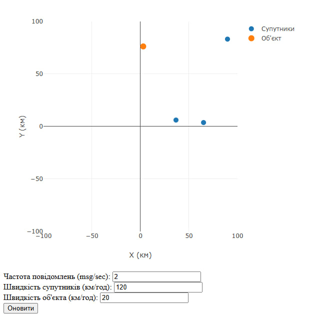

# Звіт з лабораторної роботи №5
## Розробка додатку для візуалізації вимірювань GPS

### Опис роботи
В рамках лабораторної роботи було розроблено веб-додаток для візуалізації даних GPS. Програма отримує дані через WebSocket з'єднання та використовує метод трилатерації для визначення позиції об'єкта за допомогою трьох супутників.

Основні компоненти розробленого додатку:
- Візуалізація даних на графіку в декартових координатах
- Відображення позицій супутників та об'єкта
- Налаштування параметрів системи:
  - Частота повідомлень
  - Швидкість супутників
  - Швидкість об'єкта

### Результати тестування

На зображенні представлено роботу системи з наступними параметрами:
- Частота повідомлень: 2 msg/sec
- Швидкість супутників: 120 км/год
- Швидкість об'єкта: 20 км/год

Графік демонструє:
- Три супутники (сині точки) розташовані на різних позиціях для забезпечення точної трилатерації
- Об'єкт стеження (помаранчева точка) знаходиться в координатах приблизно (0, 70)
- Діапазон вимірювання складає ±100 км по обох осях

### Висновок
Розроблений додаток успішно виконує функції візуалізації GPS-даних в реальному часі та дозволяє налаштовувати параметри системи. Реалізований метод трилатерації забезпечує точне визначення позиції об'єкта при наявності даних від трьох супутників.
